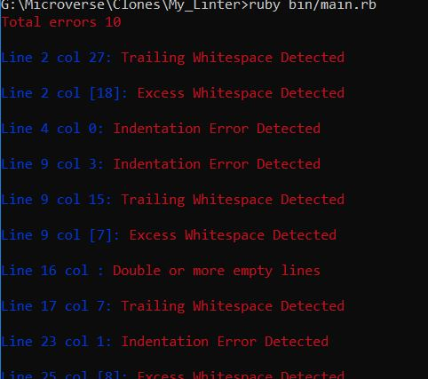

# My_Linter

# Ruby Linter Capstone Project

This project is for checking errors of linter.

## Thir project is for following error detection
- Indentation error
- Any trailing white space at the end of a line.
- Two or more empty lines.
- Two or more whitespace in a line.
- Missing third brackets, parentesis, curly brackets open or close

## Built With

- Ruby

## How to run

1. Open Terminal.
2. Navigate to your desired location to download the contents of this repository.
3. Copy and paste the following code into the Terminal: git clone `https://github.com/abmasadullah/My_Linter`
4. Run `cd My_Linter`
5. Run `ruby-install ruby`
6. Run `bundle install`
7. Run `gem install bundler`
8. Finally run `ruby bin/main.rb`

## Author

👤 **Asad**

- Github: [@abmasadullah](https://github.com/abmasadullah)
- Twitter: [@abmasadullah](https://twitter.com/abmasadullah)
- Linkedin: [@abmasadullah](https://www.linkedin.com/in/abmasadullah)

## 🤝 Contributing

Contributions, issues and feature requests are welcome!
Feel free to check the issues page.

## Show your support

Give a ⭐️ if you like this project!

## Acknowledgments

## 📝 License

This project is MIT licensed.
